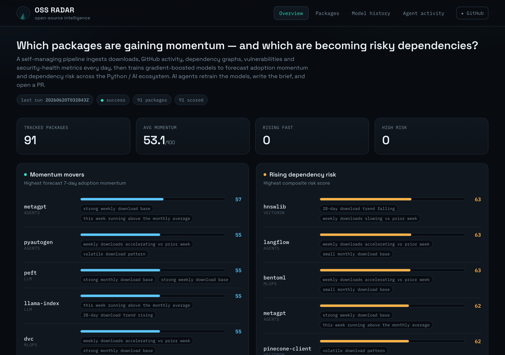
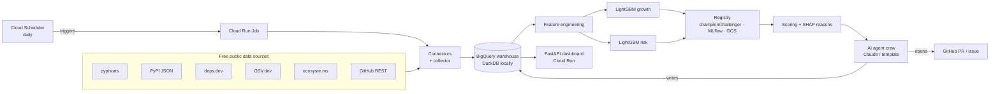

<div align="center">

# 🛰️ OSS Radar

### AI-managed open-source intelligence — *which Python/AI packages are gaining momentum, and which are becoming risky dependencies?*

[](https://github.com/MiladShd/oss-radar/actions/workflows/ci.yml)
[](https://github.com/MiladShd/oss-radar/actions/workflows/pr-preview.yml)


**🔗 Live dashboard: https://oss-radar-dashboard-wzpckox4zq-uc.a.run.app**

A self-managing data pipeline that ingests downloads, GitHub activity, dependency graphs, vulnerabilities
and security-health metrics every day, trains gradient-boosted models to forecast **adoption momentum** and
**dependency risk** across the Python / AI ecosystem, and lets a crew of **AI agents** run the system —
retraining models, writing the daily brief, and opening a pull request.

</div>



**📄 [See a sample run →](docs/sample-report.md)** — real, unedited pipeline output (momentum & risk movers, held-out model metrics, source coverage, and what the agent crew did), no setup required.

---

## Why it exists

Picking and monitoring open-source dependencies is guesswork. OSS Radar turns it into data:

- **Developers** choosing a library see which packages are accelerating and which are stalling.
- **Platform / security teams** see which dependencies are becoming risky — recent CVEs, abandonment, weak
  security posture, key-person risk — *before* it bites.
- **Everyone** gets a transparent, explainable score with the reason it was flagged.

It runs entirely on **free, no-auth public data sources**, so anyone can clone it and reproduce the data
locally — and it's **deployed live on GCP**, retraining itself on a daily schedule.

## What it does

| | |
|---|---|
| 📈 **Momentum model** | LightGBM regressor forecasting next-7-day download growth from time-series dynamics, with a time-aware backtest and SHAP explanations. |
| ⚠️ **Risk model** | LightGBM classifier + a transparent weighted composite (vulnerabilities, maintenance staleness, bus-factor, security scorecard, abandonment, issue backlog). |
| 🤖 **Agent crew** | Seven agents *manage* the pipeline (they don't make the predictions): Healer, DataEngineer, DataQuality, DataScientist, ImprovementScientist, RiskAnalyst, MLOps. |
| 🩹 **Self-healing** | The Healer retries transient ingest failures and carries forward last-known signals — a bad day at one source self-corrects instead of leaving holes. |
| 🧬 **Self-improving** | The ImprovementScientist experiments with candidate features each run and **opens a PR when one measurably lifts the model** (safe: it only proposes; CI + review gate every change). |
| 🏆 **Champion/challenger** | Every run retrains and only promotes a model if it beats the previous champion — the model-improvement history is charted on the dashboard. |
| 📊 **Live dashboard** | Movers, a searchable leaderboard, per-package signal breakdown with download sparklines, model-metric history, and a "what the agents did today" timeline. |
| 🔀 **PR workflow** | The MLOps agent opens a daily report PR; contributors can "run a PR" and the CI bot posts the resulting momentum/risk movers back as a comment. |

## Architecture



**Cloud topology:** a **Cloud Run Job** (the daily pipeline) is triggered by **Cloud Scheduler**; results land in
**BigQuery**; models are versioned in **GCS** (+ MLflow tracking); a scale-to-zero **Cloud Run Service** serves the
dashboard. Secrets live in **Secret Manager**, images in **Artifact Registry**, and the whole stack is **Terraform**.

## Data sources

| Source | Signal | Auth |
|---|---|---|
| [pypistats](https://pypistats.org) | 180-day daily download series | none |
| [PyPI JSON](https://docs.pypi.org/api/json/) | release cadence, versions, repo URL | none |
| [deps.dev](https://deps.dev) | dependency graph + OpenSSF Scorecard | none |
| [OSV.dev](https://osv.dev) | known vulnerabilities (with recency) | none |
| [ecosyste.ms](https://ecosyste.ms) | reverse-dependency counts, fresh repo stats, bus-factor | none |
| [GitHub REST](https://docs.github.com/rest) | commit volume, PR/issue velocity | optional token |

## Tech stack

`Python 3.12` · `LightGBM` + `SHAP` · `scikit-learn` · `pandas` · `DuckDB` / `BigQuery` · `MLflow` ·
`FastAPI` · `Cloud Run` · `Cloud Scheduler` · `Artifact Registry` · `Secret Manager` · `Terraform` ·
`Anthropic Claude` (agents) · `GitHub Actions`.

## ▶️ Run the demo

One command takes a fresh clone to visible OSS Radar output — it sets up a local
virtualenv, installs the pipeline and dashboard, runs the full pipeline on a small
sample into a local DuckDB warehouse (no cloud, no API keys, no side effects), and
tells you how to view it:

```bash
make demo          # or: scripts/demo_local.sh   (scripts/demo_local.sh --serve to auto-open the dashboard)
make dashboard     # then open http://localhost:8099
```

No cloud credentials or Anthropic key required. Without a GitHub token the demo
still runs — some GitHub-derived signals may be rate-limited (HTTP 403); run
`gh auth login` or set `OSS_RADAR_GITHUB_TOKEN` to lift the limit. Artifacts land
in predictable places: `oss_radar.duckdb`, `reports/<date>.md`, and `models_local/`.

## Run it locally (manual)

```bash
python3.12 -m venv .venv && source .venv/bin/activate
pip install -r pipeline/requirements.txt && pip install -e pipeline

# full pipeline on a small sample, local DuckDB, no cloud, no side effects:
OSS_RADAR_GITHUB_TOKEN=$(gh auth token) python -m oss_radar.cli run --dry-run --limit 12

# serve the dashboard against the local warehouse:
pip install -r dashboard/requirements.txt
uvicorn dashboard.app.main:app --reload --port 8099   # → http://localhost:8099
```

Optional config (watchlist size, GitHub / Anthropic tokens) lives in a `.env` file —
copy [`.env.example`](.env.example) to start. **Both tokens are optional for local runs:**
without a GitHub token some GitHub-derived signals are reduced but the demo still runs;
without an Anthropic key the agent crew runs in deterministic template mode.

Tests & lint:

```bash
pytest pipeline/tests -q
cd pipeline && ruff check oss_radar
```

## Deploy to GCP

```bash
echo "your-project-id" > .gcp_project
ANTHROPIC_API_KEY=sk-ant-...  ./scripts/deploy.sh    # omit the key for template-mode agents
```

`deploy.sh` builds both images on Cloud Build (linux/amd64), populates Secret Manager, and `terraform apply`s
the whole stack. See [docs/DEPLOY.md](docs/DEPLOY.md) for details and teardown.

## How a daily run works

1. **Ingest** ~90 curated AI/data packages across 6 sources → point-in-time `snapshots` + a 180-day download backfill.
2. **Feature-engineer** thousands of supervised `(package, as-of-date)` training rows + a cross-sectional risk frame.
3. **Train** the growth and risk models; **register** with champion/challenger promotion (MLflow + GCS).
4. **Score** every package → momentum & risk (0–100) with SHAP-driven reasons.
5. **Agents** validate freshness/quality, summarize the day, and open a report PR.
6. Everything is written to BigQuery; the dashboard reads it live.

## How it improves itself (automatically)

Several mechanisms compound every day with no human in the loop: history accumulates, models retrain, **only genuine
improvements are promoted** (strict champion/challenger), the risk model **graduates from heuristic labels to
realized forward outcomes** as snapshots accumulate, a **drift monitor** (PSI + label churn) catches when the
ecosystem shifts (escalating to a GitHub issue + forced retrain), the **Healer** recovers from transient ingest
failures, and the **ImprovementScientist** experiments with candidate features and **opens a PR when one measurably
lifts the model** — closing the loop from "drift detected" to "model improved," safely (it only proposes; CI and
review gate every change). Full write-up: **[docs/IMPROVEMENT.md](docs/IMPROVEMENT.md)**.

## Methodology & honesty

Forecasting 7-day download growth is genuinely hard, and the watchlist is small — so the models are deliberately
modest and their held-out metrics are tracked openly on the dashboard rather than hidden. The risk **score** is a
transparent, documented composite; the risk **model** is a learner whose labels and caveats are spelled out in
[docs/METHODOLOGY.md](docs/METHODOLOGY.md). Metrics improve as the daily snapshot history accumulates.

## Contributing

Open a PR — the **PR-preview** workflow runs the pipeline on your branch and comments the resulting movers.
See [CONTRIBUTING.md](CONTRIBUTING.md).

## License

[MIT](LICENSE) © 2026 Milad Shaddelan
