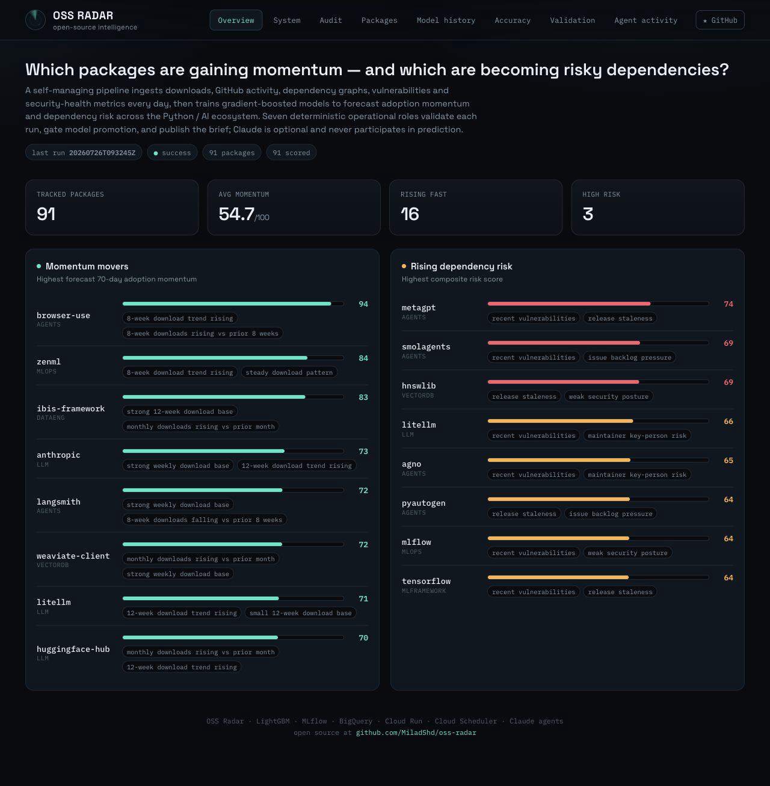
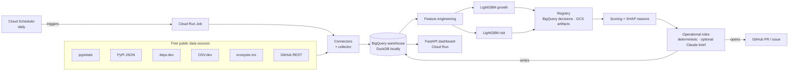

<div align="center">

# 🛰️ OSS Radar

### Operational open-source intelligence — *which Python/AI packages are gaining momentum, and which are becoming risky dependencies?*

[](https://github.com/MiladShd/oss-radar/actions/workflows/ci.yml)
[](https://github.com/MiladShd/oss-radar/actions/workflows/pr-preview.yml)


A daily open-source intelligence pipeline that ingests downloads, GitHub activity, dependency graphs,
vulnerabilities and security-health metrics, trains gradient-boosted models to rank **adoption momentum**
and **dependency risk** across the Python / AI ecosystem, and uses an optional **AI-assisted operations**
layer for checks, reporting, and narrowly gated GitHub automation.

</div>



**📄 [See the pre-operationalization production baseline →](docs/sample-report.md)** — actual
momentum/risk movers and operations activity from the 2026-07-26 production run, explicitly annotated
where that older build used evaluation and serving behavior that this release replaces.

**🔗 [Current live dashboard](https://oss-radar-dashboard-wzpckox4zq-uc.a.run.app)** — the documented
[48-hour pre-share gate](docs/OPERATIONS.md#5-pre-share-public-dashboard-gate) passed on 2026-07-27
with an exact-SHA deployment, a fresh 91-package production run, populated model/agent history, and all
seven source-health checks healthy. The screenshot and dated sample report above remain durable fallbacks.

---

## Try it in five minutes

With Python 3.12 and `make` available, install the local pipeline once, then run the deterministic fixture:

```bash
python3 -m venv .venv
.venv/bin/pip install -r pipeline/requirements.txt
.venv/bin/pip install --no-deps -e pipeline
make smoke
# underlying CLI: .venv/bin/python -m oss_radar.cli smoke --out .artifacts/smoke
```

Dependency installation may contact PyPI; after that, `make smoke` blocks Python DNS/socket access and child-process
launches while it runs. It sends a bundled three-package, 365-day fixture through ingest → features → growth
training → scoring → agent report in local DuckDB/template-agent mode. Inspect
`.artifacts/smoke/predictions.json` and `.artifacts/smoke/report.md`. This proves that the pipeline plumbing is
reproducible; it does **not** prove current public-data freshness or production model quality.

The separate **live-source mode** is `make demo`: it installs the local environment and calls the public providers,
so it needs network access, can encounter rate limits, and may take longer. Run `make dashboard` afterward to open
the resulting warehouse at <http://localhost:8099>.

## What works today

- [x] Deterministic offline smoke coverage for ingest, features, growth training, scoring, and reporting.
- [x] A live-source local demo plus a version-aware dependency audit for files, package lists, or GitHub repos.
- [x] Leak-aware model evaluation, explicit champion/challenger decisions, deterministic fallbacks, and bounded
  operational roles whose optional LLM use is limited to report prose.
- [x] A production-shaped GCP path with BigQuery, Cloud Run, Terraform, exact-SHA releases, canary/smoke checks,
  rollback, and public-dashboard safeguards.
- [x] Captured production evidence for 91 packages across six providers and seven health checks; see the dated
  [baseline report](docs/sample-report.md) and [portfolio/interview notes](docs/PORTFOLIO.md).
- [x] The public deployment passed the pre-share gate: exact SHA, health, data freshness, predictions, model
  history, and agent history were verified against the live production warehouse.

## Why it exists

Picking and monitoring open-source dependencies is guesswork. OSS Radar turns it into data:

- **Developers** choosing a library see which packages are accelerating and which are stalling.
- **Platform / security teams** see which dependencies are becoming risky — recent CVEs, abandonment, weak
  security posture, key-person risk — *before* it bites.
- **Everyone** gets the score components and scoped reasons: growth SHAP drivers and transparent
  composite-risk drivers, with any classifier contribution shown separately.

Its core inputs are **free, no-auth public data sources**, so anyone can reproduce a live-source run locally.
The production topology schedules a daily GCP job; the fixture path above remains fully offline and deterministic.

## 🔍 Audit your own dependencies

Don't just watch the ecosystem — **point it at your project.** Paste a `requirements.txt` (or a GitHub repo)
and OSS Radar returns a supply-chain risk report on *your* actual dependencies:

- **Version-aware CVEs** — a pinned `package==1.2.3` is checked against [OSV](https://osv.dev) for the
  vulnerabilities that *actually affect that version*, not the package's lifetime CVE count (which would flag
  every mature library as "critical").
- **Maintenance risk** — staleness, bus-factor, abandonment, security posture — with a transparent composite,
  optional promoted-classifier contribution, and scoped reasons.
- **Adoption trend** — week-over-week downloads, so you can spot a dependency that's quietly dying.

Any PyPI package works: watchlist packages are instant, anything else is fetched live from the same sources.

```bash
oss-radar audit -r requirements.txt                 # from a requirements file
oss-radar audit --repo pallets/flask                # straight from a GitHub repo (requirements.txt or pyproject.toml)
oss-radar audit --packages "transformers==4.30.0,vllm==0.2.0,langchain"
```

Illustrative output shape—live OSV counts and risk scores change as advisories and package metadata change:

```text
3 of 3 audited — 2 critical, 0 high, 1 watch, 0 healthy
  2 pinned version(s) exposed to ACTIVE CVEs

  !! transformers==4.30.0   risk   4.9  vuln 32 active      32 known vulns; maximum severity critical
  !! vllm==0.2.0            risk  61.0  vuln 29 active      29 known vulns; maximum severity critical
   ~ langchain              risk  53.6  vuln 38 historical  38 historical CVEs — pin a version to check exposure
```

Also in the dashboard's **Audit** tab and as `POST /api/audit` (`{"requirements": "..."}` or `{"repo": "owner/repo"}`).

## What it does

| | |
|---|---|
| 📈 **Momentum model** | LightGBM regressor estimating 70-day download log-momentum from causal download dynamics. Operational evaluation is chronological and date-grouped; a separate package-disjoint gate measures cross-sectional generalization. |
| ⚠️ **Risk model** | A transparent weighted composite plus, when a compatible promoted classifier exists, a `60% composite / 40% calibrated probability` blend. Platt calibration is learned from package-disjoint OOF predictions; archived/removed and recent high/critical vulnerability floors survive blending. |
| 🤖 **Agent crew** | Seven recorded operational roles execute eight bounded steps (they don't make the predictions): Healer, DataEngineer, DataQuality, DataScientist, ImprovementScientist, RiskAnalyst, MLOps. Claude is optional and only rewrites the brief. |
| 🩹 **Self-healing** | If a package's core `downloads_7d` ingest fails, the Healer retries that package once and can carry forward its last good snapshot. Failures in other connectors degrade their individual fields and remain visible in source health. |
| 🧬 **Feature proposals** | The ImprovementScientist experiments with a bounded candidate catalog and can open a one-file PR when a feature clears the configured offline lift bar. CI and the validation gate still decide whether it is safe to merge and promote; lift is not guaranteed. |
| 🏆 **Champion/challenger governance** | Every successfully trained candidate is recorded. Only compatible promoted learned artifacts are served; growth and risk have deterministic persistence/composite fallbacks when no compatible champion exists. A new risk lineage must clear AUC `0.55` even without an incumbent. The dashboard charts accepted and rejected runs; a better comparable-cohort score is evidence for promotion, not a guarantee of better future forecasts. |
| 📊 **Live dashboard** | Movers, a searchable leaderboard, per-package signal breakdown with download sparklines, model-metric history, and a "what the agents did today" timeline. |
| 🔀 **PR workflow** | The MLOps agent opens a daily report PR; contributors can "run a PR" and the CI bot posts the resulting momentum/risk movers back as a comment. |

## Architecture


```mermaid
flowchart LR
  subgraph Sources["Free public data sources"]
    A[pypistats] & B[PyPI JSON] & C[deps.dev] & D[OSV.dev] & E[ecosyste.ms] & F[GitHub REST]
  end
  Sources --> ING[Connectors<br/>+ collector]
  ING --> WH[(BigQuery warehouse<br/>DuckDB locally)]
  WH --> FE[Feature engineering]
  FE --> GM[LightGBM growth] & RM[LightGBM risk]
  GM & RM --> REG[Registry<br/>BigQuery decisions · GCS artifacts]
  REG --> SC[Scoring + SHAP reasons]
  SC --> AG[Operational roles<br/>deterministic · optional Claude brief]
  AG -->|writes| WH
  AG -->|opens| PR[GitHub PR / issue]
  WH --> DASH[FastAPI dashboard<br/>Cloud Run]
  SCHED[Cloud Scheduler<br/>daily] -->|triggers| JOB[Cloud Run Job]
  JOB --> ING
```

**Cloud topology:** a **Cloud Run Job** (the daily pipeline) is triggered by **Cloud Scheduler**; results land in
**BigQuery**; durable model decisions live there and durable artifacts are versioned in **GCS**. MLflow writes a
best-effort local run trace (`file:` storage, ephemeral in Cloud Run), while a scale-to-zero **Cloud Run Service**
serves the dashboard. Secrets live in **Secret Manager**, images in **Artifact Registry**, and the stack shape is
managed with **Terraform**.

## Data sources

| Source | Signal | Auth |
|---|---|---|
| [pypistats](https://pypistats.org) | 180-day daily download series | none |
| [PyPI JSON](https://docs.pypi.org/api/json/) | release cadence, versions, repo URL | none |
| [deps.dev](https://deps.dev) | dependency graph + OpenSSF Scorecard | none |
| [OSV.dev](https://osv.dev) | known vulnerabilities (with recency) | none |
| [ecosyste.ms](https://ecosyste.ms) | reverse-dependency counts, fresh repo stats, bus-factor | none |
| [GitHub REST](https://docs.github.com/rest) | commit volume, PR/issue velocity | optional token |

These are **six public providers surfaced as seven source-health checks** because ecosyste.ms package metadata
and repository metadata are monitored separately. Package discovery uses a two-level taxonomy: six stable,
mutually exclusive primary categories plus three curated cross-cutting capabilities
(`inference_serving_runtime`, `evaluation_observability`, and `workflow_orchestration`). Raw GitHub topics and
primary language are retained as upstream metadata, and limited demo runs sample categories round-robin so a
small run is representative rather than just the first entries in the watchlist.

Watchlist OSV collection is package-level and does not send a version. `max_severity_new_28d` therefore means the
worst OSV/database-or-CVSS severity among advisories published for that package in the last 28 days—not confirmed
exposure of its latest version. The dependency audit above sends an exact pinned version when one is available.

## Tech stack

`Python 3.12` · `LightGBM` + `SHAP` · `scikit-learn` · `pandas` · `DuckDB` / `BigQuery` · `MLflow` ·
`FastAPI` · `Cloud Run` · `Cloud Scheduler` · `Artifact Registry` · `Secret Manager` · `Terraform` ·
`Anthropic Claude` (optional report prose) · `GitHub Actions`.

The absence of Spark, Airflow, and dbt is deliberate at the current scale; the
[architecture notes](docs/ARCHITECTURE.md#deliberate-stack-tradeoffs) document the tradeoffs and concrete adoption
triggers.

## Operational readiness

The repository now includes the pieces needed to operate the project rather than only demonstrate it:

- **Reproducible releases:** exact-SHA-pinned Actions, workflow-bound keyless GitHub → GCP authentication, a
  Terraform-managed immutable-tag Artifact Registry repository, commit tags resolved and deployed by digest,
  component-wise resumable builds, and a dedicated least-privilege Cloud Build identity/source bucket.
- **Protected infrastructure:** versioned remote GCS Terraform state, deletion-blocking plans, `prevent_destroy`
  on durable/control-plane resources, and explicit separation between Terraform-owned shape and CD-owned releases.
- **Post-deploy verification:** the workflow verifies the zero-traffic dashboard candidate and executes the
  pipeline image in an isolated DuckDB Cloud Run smoke job whose service account has no project roles or secrets
  before updating production.
- **Bounded GitHub automation:** only exact owner-authored daily-report and allowlisted feature PRs with all
  required checks may merge; duplicate drift issues are consolidated into one auditable thread.
- **Verified bot commits:** report and feature-proposal commits are signed by GitHub through
  `createCommitOnBranch`; no automation signing key or ruleset bypass is required.
- **Public-dashboard guardrails:** package-detail warehouse queries are parameterized, responses use a short
  60-second cache, and an empty warehouse produces an explicit first-run state instead of a broken screen.
- **Honest evaluation:** package-disjoint validation, leak gates, challenger retention, and production run
  history are visible; the project does not claim that elapsed time alone makes model quality improve.

Each new environment has two intentional administrative bootstrap steps: apply the documented three-check
GitHub ruleset and provision GCP once. See [deployment](docs/DEPLOY.md),
[governance](docs/GOVERNANCE.md), and the [operations runbook](docs/OPERATIONS.md).

## ▶️ Run the demo

This live-source path takes a fresh clone to visible OSS Radar output: it sets up a local virtualenv, installs the
pipeline and dashboard, and runs the full pipeline on a small sample into local DuckDB. The script refuses a
non-DuckDB backend, so warehouse writes stay local; it makes read-only calls to public providers, while `--dry-run`
prevents GitHub PR and issue writes:

```bash
make demo          # or: scripts/demo_local.sh   (scripts/demo_local.sh --serve to auto-open the dashboard)
make dashboard     # then open http://localhost:8099
```

No cloud credentials or Anthropic key required. Without a GitHub token the demo
still runs — some GitHub-derived signals may be rate-limited (HTTP 403); run
`gh auth login` or set `OSS_RADAR_GITHUB_TOKEN` to lift the limit.

Local artifacts are intentionally predictable:

- `.venv/` — the demo's Python environment;
- `pipeline/oss_radar.egg-info/` — editable-install metadata;
- `oss_radar.duckdb` and, while DuckDB is active, `oss_radar.duckdb.wal` — the live-source warehouse;
- `models_local/` — locally trained model artifacts;
- `mlruns/` — best-effort local MLflow traces;
- `reports/<date>.md` — generated live-source reports; and
- `.artifacts/smoke/` — the isolated fixture database, models, predictions, and report.

To return the checkout to a pre-demo state while preserving tracked files:

```bash
# Intentionally discard generated changes under these demo-only paths.
rm -rf .artifacts/smoke .venv pipeline/oss_radar.egg-info models_local mlruns
rm -f oss_radar.duckdb oss_radar.duckdb.wal
git restore --worktree -- reports/
git clean -fX -- reports/
```

Set `OSS_RADAR_DUCKDB_PATH=/absolute/path/demo.duckdb` before `make demo` to redirect the live-source database;
the environment, models, MLflow trace, and report paths remain repository-relative. Remove the custom database and
its `.wal` file separately when cleaning up.

## Run it locally (manual)

```bash
python3.12 -m venv .venv && source .venv/bin/activate
pip install -r pipeline/requirements.txt -r dashboard/requirements.txt -r requirements-dev.txt
pip install --no-deps -e pipeline

# live public-source sample; force local DuckDB, and disable GitHub PR/issue writes:
OSS_RADAR_BACKEND=duckdb \
OSS_RADAR_DUCKDB_PATH="$PWD/oss_radar.duckdb" \
OSS_RADAR_GITHUB_TOKEN="$(gh auth token)" \
python -m oss_radar.cli run --dry-run --limit 12

# serve the dashboard against the local warehouse:
uvicorn dashboard.app.main:app --reload --port 8099   # → http://localhost:8099
```

Optional config (watchlist size, GitHub / Anthropic tokens) lives in a `.env` file —
copy [`.env.example`](.env.example) to start. **Both tokens are optional for local runs:**
without a GitHub token some GitHub-derived signals are reduced but the demo still runs;
without an Anthropic key the agent crew runs in deterministic template mode.

`.env` and the repository's common credential-file patterns are ignored by Git, but ignore rules are not a secret
store: never commit keys or tokens, and add any differently named local secret file to `.gitignore` before using
it. Prefer an interactive prompt locally and Secret Manager for deployed values.

Tests & lint:

```bash
pytest -q pipeline/tests dashboard/tests
ruff check pipeline/oss_radar pipeline/tests dashboard scripts
actionlint
shellcheck scripts/*.sh
pip-audit -r pipeline/requirements.txt
pip-audit -r dashboard/requirements.txt
terraform -chdir=infra/terraform fmt -check -diff
terraform -chdir=infra/terraform init -backend=false -input=false
terraform -chdir=infra/terraform validate
```

## Deploy to GCP

```bash
echo "your-project-id" > .gcp_project
./scripts/deploy.sh    # deterministic template-mode reporting

# Optional AI-written brief: read the key without putting it in shell history.
read -rsp "Anthropic API key: " ANTHROPIC_API_KEY && echo
export ANTHROPIC_API_KEY
./scripts/deploy.sh
unset ANTHROPIC_API_KEY
```

`deploy.sh` bootstraps versioned remote state, protected infrastructure, immutable component images, secrets, and
the five GitHub variables. By default it reuses or dispatches the digest/canary/smoke/rollback workflow for the
exact remote `main` commit, waits for that exact-SHA run, reconciles Terraform only after success, and verifies zero
infrastructure drift. Use `DISPATCH_DEPLOY=0` for control-plane/build bootstrap without updating an existing
production runtime. See
[docs/DEPLOY.md](docs/DEPLOY.md) for details and protected teardown.

## How a daily run works

1. **Ingest** ~90 curated AI/data packages from six public providers → seven source-health checks,
   point-in-time `snapshots`, and a 180-day download backfill.
2. **Feature-engineer** hundreds of supervised `(package, as-of-date)` rows initially (expanding as accumulated
   `download_history` grows) plus a cross-sectional risk frame.
3. **Train** the growth and risk candidates; record evaluation/promotion decisions durably in BigQuery and
   promoted artifacts in GCS.
4. **Score** every package → momentum & risk (0–100). Growth reasons are SHAP-derived; risk reasons explain the
   composite/floor portion, while the calibrated classifier probability and composite score are exposed separately.
5. **Agents** validate freshness/quality, summarize the day, and open a report PR.
6. Run records are written to BigQuery, model artifacts to GCS, and the dashboard reads the warehouse live.

## How model iteration is automated

History accumulates and both candidates retrain when there is enough data. The growth validation gate blocks
known leakage signatures. For promotion, a growth incumbent is re-scored on the candidate's exact current closed
test cohort; risk uses a stable reserved-package holdout and the same current-cohort incumbent re-score inside a
versioned evaluation lineage. If an incumbent cannot be evaluated comparably, the challenger is held. The risk
model switches from heuristic to exact-horizon realized-outcome labels once enough dated snapshots exist. Drift
monitoring records a recommendation and scopes GitHub incident updates; it does not set a hidden retrain flag
(the pipeline already retrains candidates each run). A bounded feature experiment may propose a one-file PR.

Those mechanisms automate **experimentation and governance**. They do not prove that the next model—or the system
merely running longer—will forecast better. Temporal performance must be judged on closed production cohorts as
the 70-day outcomes mature. Full write-up: **[docs/IMPROVEMENT.md](docs/IMPROVEMENT.md)**.

## Methodology & honesty

Forecasting adoption momentum is genuinely hard, and the watchlist is small — so the models are deliberately
modest and their held-out metrics are tracked openly on the dashboard rather than hidden. The growth model targets
70-day smoothed momentum, not raw 7-day noise. The risk **score** combines a documented composite, categorical
safety floors, and—only when eligible—a package-disjoint OOF-calibrated classifier; its labels and caveats are in
[docs/METHODOLOGY.md](docs/METHODOLOGY.md). More history makes stronger evaluation possible; it does not guarantee
that the measured metrics rise.

## Contributing

Open a PR — the **PR-preview** workflow runs the pipeline on your branch and comments the resulting movers.
See [CONTRIBUTING.md](CONTRIBUTING.md).

## License

[MIT](LICENSE) © 2026 Milad Shaddelan
