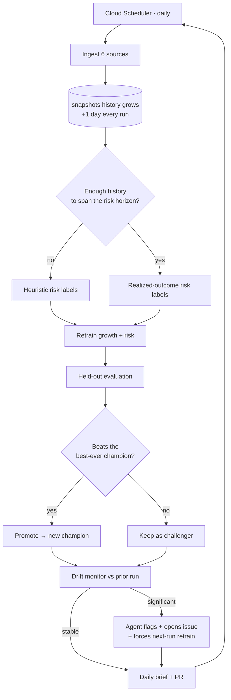

# How OSS Radar improves itself — automatically

OSS Radar is designed so that **the models get better over time with no human in the loop.** Every day the
scheduler fires the pipeline, and four mechanisms compound: history accumulates, models retrain, only genuine
improvements are promoted, the risk model graduates from heuristic labels to realized outcomes, and a drift
monitor catches when the world shifts. This document explains each mechanism and how they fit into the fully
automatic loop.



## 1. History accumulates by itself

Two clocks feed the models:

- **The download backfill** gives the growth model ~180 days of daily data on the *very first run*, so it is never
  cold-started — thousands of supervised `(package, as-of-date)` rows from day one.
- **The `snapshots` table** appends one row per package per day. This is the slow clock: star/fork/issue deltas and
  realized risk outcomes only exist *across* days. Nothing you do speeds this up — running the pipeline ten times in
  one day adds no information; one calendar day adds one. That's why early metrics are modest and improve with time.

## 2. Champion / challenger — only real improvement ships

Every run trains fresh models and evaluates them on a held-out split (time-aware for growth). The new model is
compared to the **best-ever champion** recorded in BigQuery and is promoted **only if it strictly beats it**
(`registry.PROMOTION_MARGIN`). Either way the decision and its rationale are logged:

```
DataScientist · retrain_growth_model · Growth model retrained (spearman=0.214, n_train=12480);
  promoted: spearman=0.214 > prev best 0.190.
```

So the served model's quality is **monotonic** — it can only ever stay the same or get better — and the dashboard's
"model improvement over time" chart is the honest audit trail, including the runs that were *not* promoted (◆ marks
promotions).

## 3. The risk model graduates from heuristic to realized outcomes

On day one there is no history, so the risk model trains on a transparent **heuristic label** (recent CVE, archived,
stale, key-person risk — see [METHODOLOGY.md](METHODOLOGY.md)). That's honest but circular.

As snapshots accumulate, `features/forward.py` relabels each package by **what actually happened** between an early
snapshot and a later one (`risk_horizon_days`, default 14): did a new vulnerability appear, did the repo get
archived, did downloads collapse, did releases go stale? Once enough realized-outcome rows exist
(`forward_min_rows`), the pipeline **switches automatically** and trains the risk model on outcomes instead of the
heuristic. The agent reports which mode it used:

```
DataScientist · retrain_risk_model · Risk model retrained (auc=0.71, n_train=88);
  promoted: auc=0.71 > prev best 0.66 · labels: forward-outcome.
```

This is the core of "improves with time": the longer it runs, the more the risk model is learning from reality
rather than a hand-written rule.

## 4. Drift detection — noticing when the world moves

After scoring, the run compares its predictions to the previous run using the **Population Stability Index** (PSI) on
the score distributions plus **label churn** (`models/drift.py`). The DataScientist agent reports it every day:

```
DataScientist · monitor_drift · Prediction drift vs prior run: low
  (momentum PSI 0.03, risk PSI 0.05, label churn 6%).
```

If drift is **significant** (PSI > 0.25 or churn > 30%) the agent escalates: it flags the run for feature review,
forces a from-scratch retrain on the next run, and (in the cloud) **opens a GitHub issue** with the details. PSI
bands follow the standard rule of thumb — `< 0.10` stable, `0.10–0.25` moderate, `> 0.25` significant. The drift
metrics are themselves persisted to `model_runs` (as a `monitor` series) so they can be charted and trended.

## 5. Self-healing — recovering from failures, not shipping holes

Transient failures are normal (a source rate-limits, a request times out). Instead of leaving a
gap, the **Healer** agent (`ingest/healing.py`) runs after ingest:

1. it identifies packages whose core download signal failed,
2. **retries** just those, gently and single-threaded (most transient failures clear on retry), and
3. for anything still missing, **carries forward** that package's last good snapshot so the
   dashboard and risk features don't regress.

Every healing action is bounded (one retry pass, last-known fallback) and logged:

```
Healer · self_heal_ingest · 3 package(s) failed ingest; retried and recovered 2,
  carried forward 1 from last good snapshot.
```

So a bad afternoon at one data source degrades gracefully and self-corrects, rather than
poisoning the day's run.

## 6. Self-proposing features — the improvement agent opens its own PRs

This closes the loop from *"drift detected"* to *"model improved."* The pipeline computes a
**catalog of candidate features** every run (extra download-dynamics signals) but only the
**active** set — `config/active_features.json` — actually trains the model. The
**ImprovementScientist** agent (`agents/improver.py`):

1. runs an **offline experiment** (`models/experiment.py`): trains the growth model with the
   active set vs. active + each candidate on the *same* held-out split, and measures the
   Spearman lift,
2. reports the full experiment table, and
3. if a candidate beats the lift bar (`feature_lift_margin`), **opens a PR** that enables it in
   `active_features.json`, with the measured results in the PR body.

```
ImprovementScientist · feature_experiment · Tested 4 candidate features against held-out
  Spearman: mom_28v28 Δ+0.018, recent_share Δ+0.004, trend_slope_7 Δ-0.002, ...
ImprovementScientist · open_pull_request · Proposed enabling 'mom_28v28' (Δspearman +0.018).
  → https://github.com/MiladShd/oss-radar/pull/N
```

**Why this is safe self-improvement:** the agent only *proposes*. The candidate features are
already implemented and tested; the PR is a one-line config toggle; CI and the PR-preview bot
re-run the pipeline on the branch to confirm the lift; and the change reaches the running model
only when the PR is merged (which you can make auto-merge-on-green if you want zero-touch). The
system measures and recommends its own improvements without ever silently mutating itself.

## What "fully automatic" means here

No step requires a human:

| Step | Who does it | Where |
|---|---|---|
| Trigger the daily run | Cloud Scheduler | `infra/terraform` |
| Ingest + feature-build | pipeline | Cloud Run Job |
| **Heal transient ingest failures** | **Healer agent** | **retry + carry-forward** |
| Decide heuristic vs realized labels | `choose_risk_training` | automatic on history span |
| Retrain + evaluate | models | Cloud Run Job |
| Promote only if better | registry gate | recorded in BigQuery |
| Detect drift + escalate | DataScientist agent | issue + forced retrain |
| **Experiment + propose a new feature** | **ImprovementScientist agent** | **opens a PR with measured lift** |
| Write the brief + open the PR | RiskAnalyst + MLOps agents | GitHub |

The only optional human touch is **merging the daily PR** (or reviewing a drift issue) — and even that can be made a
GitHub Actions auto-merge if you want zero-touch.

## Roadmap — how to push the self-improvement further

✅ **Done — agent-proposed features.** The ImprovementScientist agent (§6) experiments over a candidate catalog and
opens a PR when one measurably lifts the model. Remaining extensions that build on the machinery already here:

1. **Hyperparameter tuning** (Optuna) gated behind the same champion/challenger rule, so tuning can only ever help.
2. **Rolling backtests** as the snapshot history deepens — evaluate momentum calls against realized 7-day outcomes
   and surface a precision-at-K curve on the dashboard.
3. **Risk-feature candidates** — extend the candidate catalog and experiment harness to the risk model too.
4. **Auto-merge** the daily report PR and auto-close stale drift issues via GitHub Actions for true zero-touch.
5. **Per-category models** once each category has enough history to train independently.

## An honest ceiling

Self-improvement is bounded by **signal** and **calendar time**, not by cleverness. Forecasting 7-day download
growth is intrinsically noisy, and realized risk outcomes accrue one day at a time. What this design guarantees is
that the system **never regresses** (champion/challenger), **always learns from the freshest reality** (forward
relabeling), and **tells you when something breaks** (drift monitoring) — automatically, every day.
