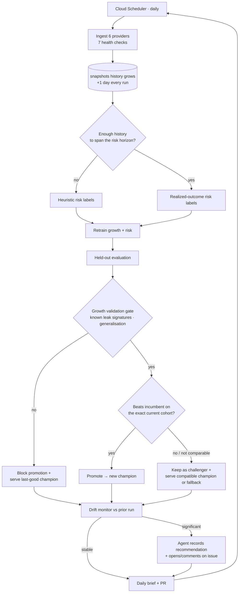

# How OSS Radar automates model iteration

OSS Radar automates the repetitive parts of model operations: collecting history, retraining candidates,
running validation gates, retaining or replacing registered artifacts, monitoring drift, and proposing bounded
feature changes. These mechanisms make improvement **testable and auditable**; they do not guarantee that model
quality rises with every run. This document explains the loop, its safeguards, and where human judgment remains.


```mermaid
flowchart TD
  S[Cloud Scheduler · daily] --> I[Ingest 6 providers<br/>7 health checks]
  I --> H[(snapshots history grows<br/>+1 day every run)]
  H --> L{Enough history<br/>to span the risk horizon?}
  L -- no --> HL[Heuristic risk labels]
  L -- yes --> FL[Realized-outcome risk labels]
  HL & FL --> T[Retrain growth + risk]
  T --> E[Held-out evaluation]
  E --> VG{Growth validation gate<br/>known leak signatures · generalisation}
  VG -- no --> RB[Block promotion +<br/>serve last-good champion]
  VG -- yes --> G{Beats incumbent on<br/>the exact current cohort?}
  G -- yes --> P[Promote → new champion]
  G -- no / not comparable --> C[Keep as challenger +<br/>serve compatible champion or fallback]
  RB & P & C --> D[Drift monitor vs prior run]
  D -- significant --> A[Agent records recommendation<br/>+ opens/comments on issue]
  D -- stable --> R[Daily brief + PR]
  A --> R
  R --> S
```

## 1. History accumulates by itself

Two clocks feed the models:

- **The download backfill** gives the growth model ~180 days of daily data on the *very first run*, so it is never
  cold-started — hundreds of supervised `(package, as-of-date)` rows from day one (819 in the captured
  91-package frame). Later rolling API windows are
  upserted by `(package, date)`; revised values replace old ones while dates outside the latest window remain. The
  learning set therefore expands instead of being erased and rebuilt at the same size every morning.
- **The `snapshots` table** appends one row per package per day. This is the slow clock: star/fork/issue deltas and
  realized risk outcomes only exist *across* days. Nothing you do speeds this up — running the pipeline ten times in
  one day adds no information; one calendar day adds one. Early metrics are therefore based on limited temporal
  evidence; additional days make stronger evaluation possible without guaranteeing a higher score.

## 2. Champion / challenger — controlled artifact selection

When enough data exists, every run trains fresh candidates. Growth uses a chronological, date-grouped
70/15/15 train/validation/test split: validation is used for early stopping, the frozen iteration count is refit
on train+validation, and the untouched test supplies the primary Spearman. Because current source depth cannot
support a 70-day embargo, this is an operational comparison cohort rather than independent temporal evidence.

Promotion does not compare a moving-cohort candidate with a stale "best ever" number. The pipeline loads the
incumbent growth artifact and re-scores it on the candidate's exact current closed test cohort. Risk reserves a
stable SHA-256-selected set of package names that the served model never trains on; challenger and compatible
incumbent are scored on that same current reserved-package cohort. Risk probabilities are Platt-calibrated using
only package-disjoint grouped OOF predictions from the non-reserved training packages; the reserved benchmark stays
untouched until evaluation. Label version, split version, benchmark kind, and benchmark hash are persisted. If the
incumbent cannot be evaluated on the identical benchmark, the challenger is held. A comparable challenger is
promoted only when it strictly beats the incumbent by `registry.PROMOTION_MARGIN`; growth must also pass its
separate leakage/generalization gate. A first risk champion in a new lineage must independently clear the absolute
bootstrap floor `group_auc >= 0.55`.

Either way the decision and its rationale are logged. For example:

```
DataScientist · retrain_growth_model · Growth candidate retrained (spearman=0.842);
  held challenger after the incumbent was re-scored on the same benchmark.
```

The selected artifact therefore cannot be replaced by a challenger that loses a valid configured comparison. That
is a deployment invariant, not a claim that real-world forecast quality can only rise: evaluation windows move,
metrics are noisy, and the 70-day production outcomes have to mature before temporal performance can be scored.
The dashboard shows accepted and rejected candidates so that distinction remains visible.

## 2b. The validation gate — known leakage signatures are blocked

"Beats the incumbent on the same cohort" is necessary but **not sufficient**: a model can post a great held-out
number because it *leaks* (the controlled centered-MA ablation reproduced R² `0.702`, versus `0.582` after the
causal fix; shared-package identity then left `0.582` same-package versus `0.363` package-disjoint — see
[VALIDATION.md](VALIDATION.md)). So before champion/challenger even runs, every retrained growth
model must clear a **hard validation gate** (`models/validation_gate.py`), which encodes the validation findings as
three automatic checks:

1. **has-skill** — held-out R² beats the mean predictor *and* Spearman clears a floor (it actually predicts).
2. **generalises** — package-disjoint (GroupKFold) Spearman clears a floor, *and* the same-package → unseen-package
   R² gap isn't blown out (the shared-package memorisation-leak signature).
3. **not-too-good** — held-out R² is below a ceiling; an implausibly high R² on this intrinsically noisy 70-day
   target is the fingerprint of a re-introduced lookahead leak.

Thresholds live in `settings` (`gate_*`) and encode floors/ceilings derived from the validation work; the
historical point estimates in [VALIDATION.md](VALIDATION.md) are evidence, not the literal threshold values. The
growth gate's verdict is **enforced in three places**:

- **Promotion** — `registry.persist(..., gate_passed=…)` blocks a gate-failing growth model from becoming champion
  no matter how good its primary metric looks. A growth `is_champion == TRUE` row therefore cleared the configured
  growth gate. Risk does not use this gate; it is constrained by its versioned stable package-disjoint lineage.
- **Serving / fallback** — only compatible `is_champion` learned artifacts are served. If a candidate fails the
  growth gate, loses a valid comparison, or cannot be compared, the pipeline loads a compatible last-good champion.
  If none exists, growth uses a deterministic persistence baseline and risk remains composite-only; an unpromoted
  risk classifier cannot leak into the score.
- **CI** — `pytest pipeline/tests/test_validation_gate.py` is a required check (a PR that weakens the gate fails CI),
  and the PR-preview job runs `oss-radar gate --require-pass` so a leak introduced on a branch fails the PR.

```
DataScientist · validation_gate · BLOCKED: not_leaky_ceiling R²=0.93 > 0.90 (re-introduced lookahead leak?);
  auto-rollback → serving last-good champion growth-20260615T0930Z.
```

When data is too thin to verify anything (early days, `< min_train_rows`), the gate **skips** rather than blocks.
The pipeline serves a compatible champion when one exists, otherwise the documented deterministic fallback.

## 3. The risk model graduates from heuristic to realized outcomes

On day one there is no history, so the risk model trains on a transparent **heuristic label** (recent CVE, archived,
stale, key-person risk — see [METHODOLOGY.md](METHODOLOGY.md)). That's honest but circular.

As snapshots accumulate, `features/forward.py` relabels every eligible package-day by **what actually happened** at
a fixed future horizon (`risk_horizon_days`, default 14): did a new vulnerability appear, did the repo get archived,
did downloads collapse, did releases go stale? Only the snapshot on the **exact +14-day outcome date** is used;
anchors without that date are skipped, so missing collection days cannot silently create variable horizons.
Duplicate package-days from retries are collapsed. Once enough realized-outcome rows exist
(`forward_min_rows`), the pipeline **switches automatically** and trains the risk model on outcomes instead of the
heuristic. A stable reserved-package holdout supplies the promotion AUC; `StratifiedGroupKFold` on the remaining
packages generates the OOF probabilities used to fit the Platt calibrator. If grouped OOF calibration cannot be
formed, no learned risk model is eligible and scoring stays composite-only. The agent reports which mode it used:

```
DataScientist · retrain_risk_model · Risk model retrained (auc=0.71, n_train=88);
  promoted: group_auc=0.71 > incumbent 0.66 on the same reserved-package benchmark
  · labels: forward-outcome.
```

This improves the **supervision source** over time: the classifier can learn from dated outcomes rather than only
a hand-written rule. Whether its discrimination improves is still an empirical question measured on the stable
reserved-package cohort and, later, additional closed production cohorts.

The risk score also has a non-statistical safety policy. Archived or removed packages cannot score below `85`;
recently published critical vulnerabilities cannot score below `75`; and recently published high-severity
vulnerabilities cannot score below `66`. “Recent” uses `max_severity_new_28d`, normalized from OSV database labels
or numeric/CVSS vectors. The floor is re-applied after the 60/40 composite/calibrated-probability blend, so a low
classifier probability cannot dilute an explicit categorical hazard. Production watchlist OSV calls are
package-level and version-unaware; exact pinned-version exposure belongs to the dependency-audit path.

## 4. Drift detection — noticing when the world moves

After scoring, the run compares its predictions to the previous run using the **Population Stability Index** (PSI) on
the score distributions plus **label churn** (`models/drift.py`). The DataScientist agent reports it every day:

```
DataScientist · monitor_drift · Prediction drift vs prior run: low
  (momentum PSI 0.03, risk PSI 0.05, label churn 6%).
```

If drift is **significant** (PSI > 0.25 or churn > 30%) the agent escalates: it records a feature-review
recommendation and (in the cloud) **opens or comments on a narrowly matched GitHub issue** with the details. It
does not set a persisted "force retrain" flag—the pipeline already retrains candidates on each eligible run. PSI
bands follow the standard rule of thumb — `< 0.10` stable, `0.10–0.25` moderate, `> 0.25` significant. The drift
metrics are themselves persisted to `model_runs` (as a `monitor` series) so they can be charted and trended.

## 5. Self-healing — recovering from failures, not shipping holes

Transient failures are normal (a source rate-limits, a request times out). The **Healer** agent
(`ingest/healing.py`) has a deliberately narrow recovery contract for packages whose core
`downloads_7d` signal is missing:

1. it identifies packages whose core download signal failed,
2. **retries** just those, gently and single-threaded (most transient failures clear on retry), and
3. for anything still missing, **carries forward** that package's last good snapshot so the
   dashboard and risk features don't regress.

Other connector failures do not trigger whole-snapshot carry-forward; their individual fields degrade to missing
values and are reported through source coverage. This avoids presenting a stale snapshot as fresh merely because
one auxiliary provider was unavailable.

Every healing action is bounded (one retry pass, last-known fallback) and logged:

```
Healer · self_heal_ingest · 3 package(s) failed ingest; retried and recovered 2,
  carried forward 1 from last good snapshot.
```

So a bad afternoon at one data source degrades gracefully and self-corrects, rather than
poisoning the day's run.

## 6. Self-proposing features — the improvement agent opens bounded PRs

This provides a reviewable path from *"drift detected"* to *"candidate tested."* The pipeline computes a
**catalog of candidate features** every run (extra download-dynamics signals) but only the
**active** set — `config/active_features.json` — actually trains the model. The
**ImprovementScientist** agent (`agents/improver.py`):

1. runs an **offline experiment** (`models/experiment.py`): trains the growth model with the
   active set vs. active + each candidate on the *same* held-out split, and measures the
   Spearman lift,
2. reports the full experiment table, and
3. if a candidate beats the lift bar (`feature_lift_margin`), **opens a PR** that enables it in
   `active_features.json`, with the measured results in the PR body.

```
ImprovementScientist · feature_experiment · Tested 3 candidate features against held-out
  Spearman: recent_share Δ+0.018, dow_volatility_7 Δ+0.004, trend_slope_7 Δ-0.002.
ImprovementScientist · open_pull_request · Proposed enabling 'recent_share' (Δspearman +0.018).
  → https://github.com/MiladShd/oss-radar/pull/N
```

**Why this is bounded:** the candidate features are already implemented and tested; the PR is a
one-file config toggle; CI, CodeQL, and the PR-preview bot re-run on the branch. Auto-triage then merges only an
exact allowlisted feature addition after it is current with `main` and all three checks pass. The workflow has
no ruleset bypass and performs a normal squash merge.

An offline lift can be noise or can fail the stronger validation gate. Opening or even merging the proposal is
therefore not presented as proof that production performance improved.

## What the automated path covers

After the one-time GCP and GitHub ruleset bootstrap, the routine path is automated:

| Step | Who does it | Where |
|---|---|---|
| Trigger the daily run | Cloud Scheduler | `infra/terraform` |
| Ingest + feature-build | pipeline | Cloud Run Job |
| **Heal transient ingest failures** | **Healer agent** | **retry + carry-forward** |
| Decide heuristic vs realized labels | `choose_risk_training` | automatic on history span |
| Retrain + evaluate | models | date-grouped growth + calibrated package-disjoint risk |
| **Block leaks / sub-baseline models** | **validation gate** | **`models/validation_gate.py` (promotion + CI)** |
| Select only if comparison and gate rules pass | registry gate | recorded in BigQuery |
| **Auto-rollback a failed candidate** | **registry / pipeline** | **serve last-good champion** |
| Detect drift + escalate | DataScientist agent | recommendation + scoped issue tracking |
| **Experiment + propose a new feature** | **ImprovementScientist agent** | **opens a PR with measured lift** |
| Write the brief + open the PR | RiskAnalyst + MLOps agents | GitHub |
| Merge exact green bot PRs | allowlisted auto-triage | GitHub Actions |
| Deploy selected runtime paths on `main` | keyless WIF deploy workflow | `pipeline/**`, `dashboard/**`, Cloud Build config, or deploy-workflow changes |

Human judgment is still required for the initial infrastructure/ruleset bootstrap, drift investigations, failed
checks, changing thresholds or candidate catalogs, and any change outside the narrow report/feature allowlists.
Terraform changes are intentionally **not** auto-applied by a push; an authenticated operator must review and apply
them explicitly.
Automation removes repetitive work; it does not delegate ownership of the system.

## Roadmap — how to push the self-improvement further

✅ **Done — agent-proposed features.** The ImprovementScientist agent (§6) experiments over a candidate catalog and
opens a PR when one measurably lifts the model. Remaining extensions that build on the machinery already here:

1. **Hyperparameter tuning** (Optuna) gated behind the same validation and champion/challenger rules.
2. **Rolling backtests** as the snapshot history deepens — evaluate momentum calls against realized 70-day outcomes
   and surface a precision-at-K curve on the dashboard.
3. **Risk-feature candidates** — extend the candidate catalog and experiment harness to the risk model too.
4. **Per-category models** once each category has enough history to train independently.

## An honest ceiling

Automated iteration is bounded by **signal** and **calendar time**, not by cleverness. Forecasting download
momentum is intrinsically noisy, and realized risk outcomes accrue one day at a time. The enforceable guarantees
are narrower: a gate-failing candidate is not promoted, a losing challenger does not replace the selected
artifact, every decision is persisted, and material prediction drift is surfaced. Whether forecasts improve is
measured—not assumed.
