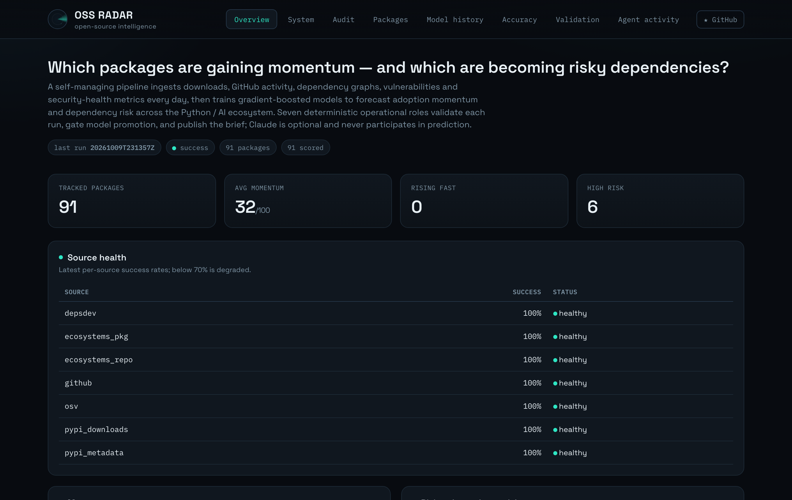
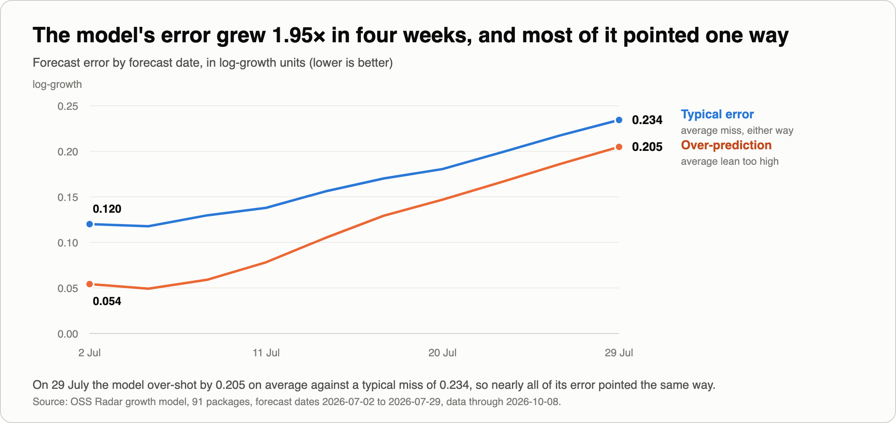
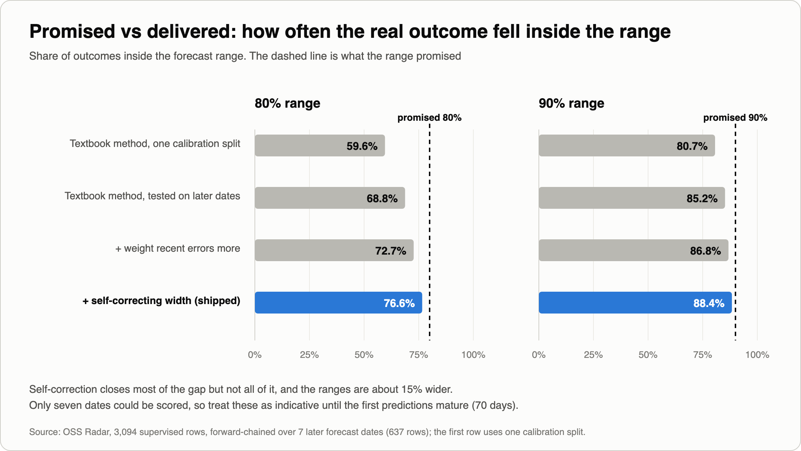
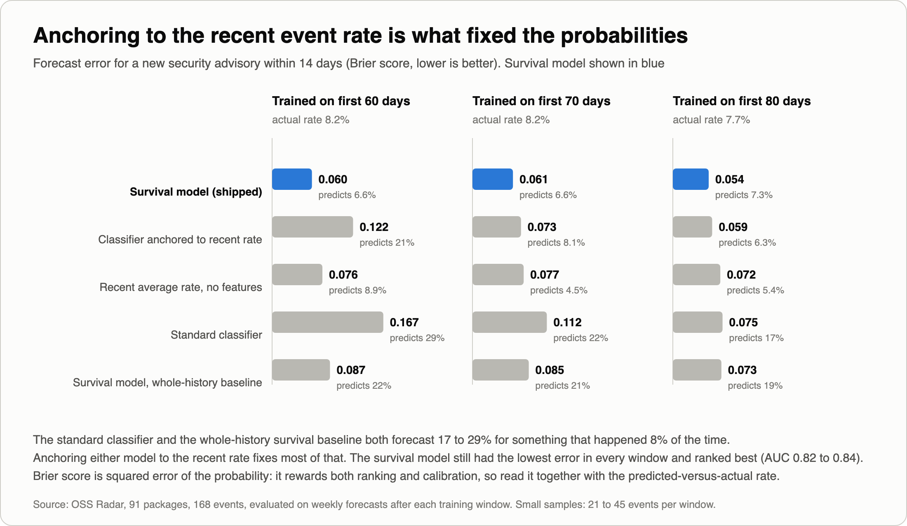
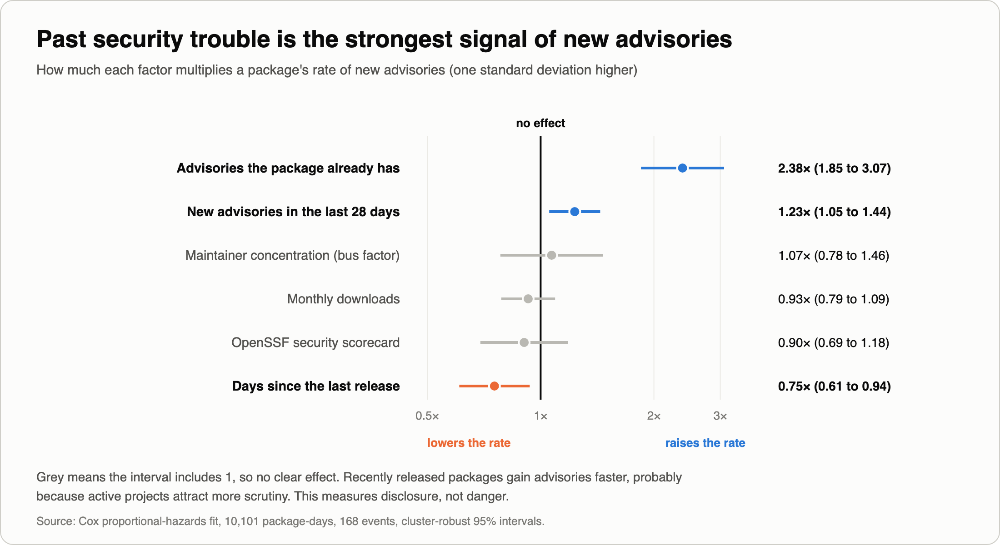
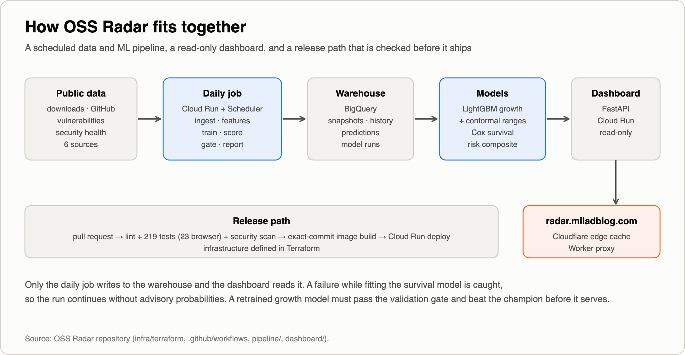

# My "80% confidence" forecasts were right 59.6% of the time

*What I found when I made a dependency-risk dashboard honest about what it doesn't know — and what an independent review caught in my own work.*

---

Teams make real decisions about open-source dependencies: which one to adopt, which one to replace, which one to patch this sprint. Most tools help with a number — a score, a rank, a grade — and almost none say **how much to trust it**.

I built [OSS Radar](https://radar.miladblog.com) to explore that gap. It's a personal project on public data: every day it pulls downloads, repository activity, vulnerabilities and security-health signals for 91 Python and AI packages, forecasts which ones are gaining momentum, and flags which are becoming risky to depend on.

This post is about two upgrades that made its uncertainty more visible, the places where my first attempt was wrong, and the corrections an independent review forced.

## The problem with a confident number

The dashboard originally said things like *"this package will grow 12% over 70 days."* One number, no range. If the real range is −20% to +45%, that precision is false, and a decision made on it is a gamble you didn't know you were taking.

The fix is a **prediction interval**: "12%, likely between −5% and +35%." I added one using conformal prediction, a method that comes with a nice property: *under an assumption that the future resembles the data used to calibrate it*, an "80% interval" contains the real outcome at least 80% of the time, for almost any model.

I tested that on my own data, calibrating on one period and checking on a later one. **The 80% interval held 59.6% of the time.**

## Why the guarantee broke

Nothing "broke". The property depends on an assumption the data didn't satisfy: the model's errors were getting bigger over time.

Typical error nearly doubled in four weeks, and it leaned one way: the model kept expecting more growth than materialised. I can't say why with certainty — slower summer download growth is a plausible candidate, but I didn't isolate it. What matters is the consequence: ranges sized from older, smaller errors were too narrow for the errors coming next.

The lesson I'd offer any team shipping forecasts: **a confidence guarantee is only as good as an assumption you can't directly test.** I caught this because I evaluated on dates *later* than the ones I calibrated on. Mixing old and new periods in a random split could have hidden the deterioration.

## The fix, in plain terms

Two changes, both drawn from the research literature:

1. **Weight recent mistakes more.** When sizing the range, recent errors count for more than old ones, so the range follows current conditions.
2. **Self-correct.** If the last few ranges missed more often than promised, widen the next one; if they were too generous, tighten.

Evaluated the honest way — each date predicted using only earlier dates:

That's a real improvement and **not a fix**: ranges are about 15% wider and still short of the promise. Here is what I can and can't claim:

- Only **7 dates** could be scored.
- The self-correcting step is a **heuristic, not the published algorithm**. I clip and batch it in ways that break the theorem it's modelled on, and under strong, sustained drift it can still miss almost everything.
- Outcomes take 70 days to resolve, so in production the calibration is staler than in my test, and live coverage may be lower.
- I chose one setting by comparing a small grid on the same dates I report, so 76.6% is indicative, not an unbiased estimate.

The real test costs nothing: ranges are stored with each prediction, so once 70 days pass I can score them against reality and publish the *measured* coverage.

## Second upgrade: "how likely is a new security advisory soon?"

The existing risk model answered a yes/no question over a fixed 14 days. That throws away *when* things happen and treats a package watched for two weeks the same as one watched for 110 days.

I added a **time-to-event view** (survival analysis, the family used for customer churn) alongside it: given what we know today, what's the chance a package receives a new security advisory in the next 14 or 30 days? It's shown next to the existing risk score and does not change it.

Three design decisions mattered:

- **Real events, with caveats.** 168 observed increases in a package's advisory count across 91 packages. The count only goes up (one decrease in 10,000+ package-days), but a count increase can't distinguish a new publication from a backfill, so I call these *observed advisory-count increases*, not verified disclosures.
- **Common shocks handled.** On three separate days (30 June, 8 July, 14 July), 21 to 26 packages each gained advisories at once, which looks like bulk publication. The model uses calendar time as its clock so those spikes aren't blamed on package features.
- **No peeking, and no guessing.** Every input is as of the day *before* what's being predicted, and a day where the data source failed is treated as unobserved, never as "zero advisories".

### What actually fixed the probabilities

My first draft of this section said the survival model "beat the obvious alternative". Review forced a harder look, and the honest answer is more specific.

I compared the survival model with a standard classifier on the same inputs, plus controls that give the classifier and the survival model the same treatment of recent history. Trained on the first 60, 70 or 80 days, forecasting later dates:

- **The standard classifier forecast 17–29% for something that happened about 8% of the time.** So did the *same survival model* (19–22%) when I let its baseline hazard be the whole training history. Training windows that contain bulk-publication spikes teach any model a rate that's too high for what follows.
- **What fixed it was anchoring to the recent event rate** — a treatment any model can get. Give the classifier that treatment and it comes close in two of three windows.
- **The survival model still had the lowest forecast error in every window**, and ranked best of the model-based forecasts (AUC 0.82–0.84 vs 0.79–0.82). But the margins are modest, the samples are small (21–45 events per window), and a constant "recent average rate" with no features at all was a strong baseline: the features improve on it by about 0.016.

So the defensible claim isn't "survival analysis fixes calibration". It's: **anchor probabilities to the recent rate, and then a model with a few well-chosen features adds a small, consistent improvement.** Brier score rewards ranking and calibration together, and nothing here validates calibration at individual probability levels or a decision threshold — those remain open.

### The result I almost left out

One input — *how many advisories the package already has* — ranks packages **slightly better than the whole model** (0.85 vs 0.82–0.84). Past security trouble is the strongest signal by a distance: each standard deviation more history is associated with about 2.3× the rate of advisory-count increases.

I'm reporting that because it changes what the model is for. If you only need a ranking, sort by advisory history. What the survival form adds is probabilities on a recent-rate scale, hazard ratios with intervals, and correct handling of partial follow-up. As an illustration of how it reads: on today's data it puts 9 of the 91 packages at 50% or higher for a new advisory within 30 days and 20 at 25% or higher, with a median around 10%. Those are estimates under today's regime, not evaluated forecasts.

And one result that cuts against a common instinct: in this retrospective fit, **more recently released packages show *higher* rates of advisory-count increases**. My original risk score penalised "stale" packages. A scrutiny explanation — active projects attract more disclosure — is plausible, but I haven't tested it, so the model measures advisory *arrival*, not danger.

## What the review caught

I asked an independent reviewer to attack this work before publishing. It found real problems, which I verified and fixed:

- **An open proxy on my own domain.** The Cloudflare Worker that serves the dashboard built its upstream URL in a way that let `//other-site/path` escape to another host. I confirmed it live, closed it, and added regression tests.
- **A leak in my evaluation.** My calibration model had been early-stopped on the same validation dates it was then scored on. I rebuilt it so no scored label can influence it, added a test that fails if one does, and re-ran every number in this post.
- **A data-quality hole.** When the vulnerability source fails, my collector stored "zero advisories", and the recovery would have looked like a burst of new ones. Those days are now unobserved. (The snapshot behind the results contains no failed lookups, so the numbers didn't change.)
- **Overclaims in my own writing.** "Calibrated", "genuine disclosures" and "proved" all got walked back to what the evidence supports.

## What made this trustworthy

- **Evaluation that tries not to flatter itself.** Every predictive number is from forecasting dates later than the training dates, using a retrospective chronological split. Hazard ratios describe the fitted sample.
- **Independent verification of the maths.** I wrote the model's core by hand, then checked it against brute-force likelihood loops and an equivalent Poisson regression: coefficients agree to about 1e-14 on the real data. A separate library I tried first disagreed; I traced it to that library failing to converge, not by trusting either.
- **Tests that match the product.** More than 200 automated tests, including headless-browser tests that drive the real dashboard against a seeded database. In CI the browser tests are required to run, and a missing browser fails the build.
- **Limits written down.** Each method ships with a document stating what it doesn't show, and every figure in this post can be regenerated from scripts in the repository.
- **A boring, safe rollout.** Changes go through a pull request, automated checks, then a deploy tied to the exact commit. Survival forecasts are informational and don't alter the existing risk score; if fitting them fails, the run continues without them.

## Limits, and what's next

This is a personal project on about 110 days of public data. 168 events is enough to estimate a few effects, not dozens; evaluation windows hold 14–45 positive cases from overlapping weekly forecasts, so AUC uncertainty was not estimated and shouldn't be assumed small. It predicts when advisory counts increase, not whether a package is exploitable.

Next: publish the measured coverage once the first predictions mature, model the 70-day delay explicitly, add reliability checks and uncertainty for the advisory probabilities, and separate "gets an advisory" from "goes stale" as competing events.

---

*Code, derivations, evidence scripts and tests: [github.com/MiladShd/oss-radar](https://github.com/MiladShd/oss-radar) — see `docs/CONFORMAL.md` and `docs/SURVIVAL.md`. Live dashboard: [radar.miladblog.com](https://radar.miladblog.com).*

*Stack: Python, LightGBM, BigQuery, Cloud Run, Terraform, GitHub Actions, FastAPI, Playwright.*
